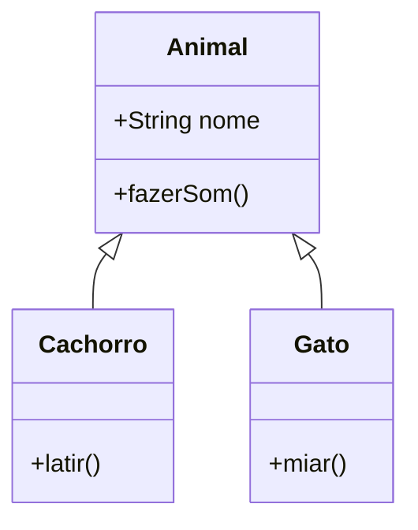
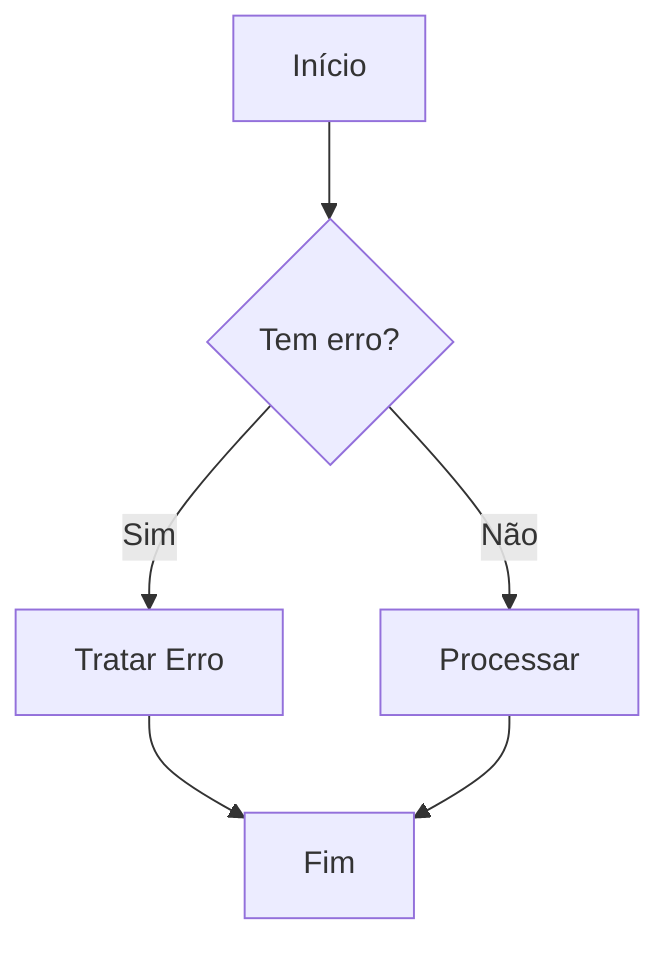

# Recursos Visuais

Esta página demonstra o uso de recursos visuais avançados na documentação.

## 1. Terminal Animado (Termynal)

Podemos simular a execução de comandos no terminal para ensinar processos como compilação ou execução de scripts.

```termynal-to-html
$ python script.py
Consultando banco de dados...
Processando dados...
[SUCCESS] Dados processados com sucesso!
```

Outro exemplo:

```termynal-to-html
$ pip install fastapi
Downloading fastapi-0.68.1-py3-none-any.whl (52 kB)
Installing collected packages: fastapi
Successfully installed fastapi-0.68.1
```

### Exemplo Interativo com Barra de Progresso

```termynal-to-html
$ python manage.py migrate
Operations to perform:
  Apply all migrations: admin, auth, contenttypes, sessions
Running migrations:
  Applying contenttypes.0001_initial... OK
  Applying auth.0001_initial... OK
  Applying admin.0001_initial... OK
  Applying sessions.0001_initial... OK
$ python train_model.py
Training Epoch 1/10: 100%|██████████| 500/500 [00:15<00:00, 32.15it/s] loss: 0.452
Training Epoch 2/10: 100%|██████████| 500/500 [00:14<00:00, 33.10it/s] loss: 0.312
Training Epoch 3/10:  45%|████▌     | 225/500 [00:06<00:08, 32.00it/s] loss: 0.289
```

### Exemplo de Input do Usuário

```termynal-to-html
$ git commit -a
Please enter the commit message for your changes. Lines starting
with '#' will be ignored, and an empty message aborts the commit.
On branch main
Changes to be committed:
  modified:   README.md
  modified:   main.py
> Refatorando a função de login
[main 8f23a1b] Refatorando a função de login
 2 files changed, 15 insertions(+), 3 deletions(-)
```

## 2. Diagramas (Mermaid.js)

Podemos usar diagramas para explicar conceitos complexos como herança de classes.

### Exemplo de Herança



### Exemplo de Fluxo


