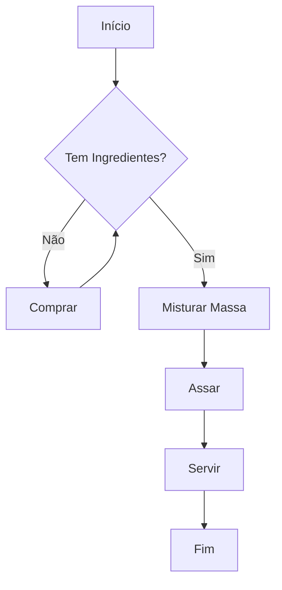

# Aula 01 - Introdução à Computação e Python

## 🎯 Objetivos da Aula

- [ ] Compreender o que é lógica de programação e algoritmos
- [ ] Conhecer a linguagem Python e suas características
- [ ] Preparar o ambiente de desenvolvimento (VSCode + Python)
- [ ] Escrever e executar o primeiro código ("Olá Mundo")
- [ ] Entender o conceito de entrada e saída básica

---

## 📚 Conteúdo

### 1. O que é Programação?

Programação é a arte de dar instruções a um computador para que ele realize tarefas específicas. Computadores não são "inteligentes"; eles são extremamente rápidos e obedientes. Eles precisam de comandos precisos para funcionar.

Esses comandos são organizados em uma sequência lógica chamada **Algoritmo**.

> **Definição:** Um **Algoritmo** é uma sequência finita de passos bem definidos para resolver um problema.

**Exemplo do dia a dia (Receita de Bolo):**
1. Pegar os ingredientes
2. Misturar a massa
3. Colocar no forno
4. Esperar assar
5. Servir

Na computação, usamos **Linguagens de Programação** para escrever esses algoritmos de uma forma que o computador entenda.




### 2. Por que Python?

Python é uma das linguagens mais populares do mundo. Ela foi criada por **Guido van Rossum** e lançada em 1991.

**Principais características:**
- **Simplicidade:** Sintaxe limpa e fácil de ler (parece inglês!).
- **Versatilidade:** Usada em Web, Data Science, IA, Automação, Jogos, etc.
- **Comunidade:** Milhares de bibliotecas prontas e muito suporte.

### 3. Ambiente de Desenvolvimento

Para programar em Python, precisamos de duas ferramentas principais:

1.  **Interpretador Python:** O programa que lê e executa seu código.
2.  **Editor de Código (IDE):** Onde escrevemos o código. Usaremos o **Visual Studio Code (VSCode)**.

!!! info "Guia de Instalação"
    Se você ainda não instalou o Python e o VSCode, consulte nosso [Guia de Instalação](../setups/setup-01.md).

### 4. Seu Primeiro Código: "Olá Mundo"

A tradição na programação diz que o primeiro código que você escreve em uma nova linguagem deve exibir a mensagem "Olá Mundo" na tela. Em Python, isso é extremamente simples.

Usamos a função `print()` para mostrar (imprimir) informações na tela.

**Exemplo:**

---

<!-- termynal -->
```console
$ print("Olá, Mundo!")
---> 100%
$ Olá, Mundo!
```

---

```python
print("Olá, Mundo!")
```

**O que aconteceu?**
- `print`: É o comando (função) que diz ao Python: "Mostre isso na tela".
- `(...)`: Os parênteses indicam que estamos chamando uma função.
- `"Olá, Mundo!"`: As aspas indicam que isso é um **texto** (string), e não um comando.

### 5. Comentários

Comentários são anotações no código que o Python ignora. Eles servem para explicar o que o código faz para você mesmo (no futuro) ou para outros programadores.

```python
# Isto é um comentário de uma linha
print("Python é legal")  # Comentário na frente do código

"""
Isto é um comentário
de múltiplas linhas (Docstring)
"""
```

### 6. Variáveis (Intro rápida)

Imagine que variáveis são **caixinhas** na memória do computador onde guardamos informações. Cada caixinha tem um **nome** (rótulo) e um **valor** (conteúdo).

```python
mensagem = "Bem-vindo ao curso!"
print(mensagem)
```

Neste exemplo:
1. Criamos uma variável chamada `mensagem`.
2. Guardamos o texto `"Bem-vindo ao curso!"` dentro dela.
3. Pedimos para imprimir o *conteúdo* da variável `mensagem`.

---

## 💻 Em Prática

Vamos abrir o VSCode e criar um arquivo chamado `aula01.py`.

**Desafio:**
Escreva um código que imprima seu nome, sua idade e sua cidade, um por linha.

```python
# aula01.py

print("Nome: Ricardo")
print("Idade: 30")
print("Cidade: São Paulo")
```

Para executar:
1. Abra o terminal no VSCode (`Ctrl + '`)
2. Digite: `python aula01.py`

---

## 📝 Resumo

- **Algoritmo** é uma sequência de passos para resolver um problema.
- **Python** é uma linguagem de alto nível, fácil e poderosa.
- Usamos `print("Texto")` para mostrar informações na tela.
- Comentários (`#`) servem para documentar o código e são ignorados pelo computador.

---

## 🎯 Próximos Passos

<div class="grid cards" markdown>

-   :material-presentation: **Acessar Slides**
    -   [Ver Slides da Aula](../slides/slide-01.html)

-   :material-school: **Quiz**
    -   [Responder Quiz](../quizzes/quiz-01.md)

-   :material-dumbbell: **Exercícios**
    -   [Lista de Exercícios](../exercicios/exercicio-01.md)

-   :material-rocket: **Projeto**
    -   [Mini Projeto](../projetos/projeto-01.md)

</div>
