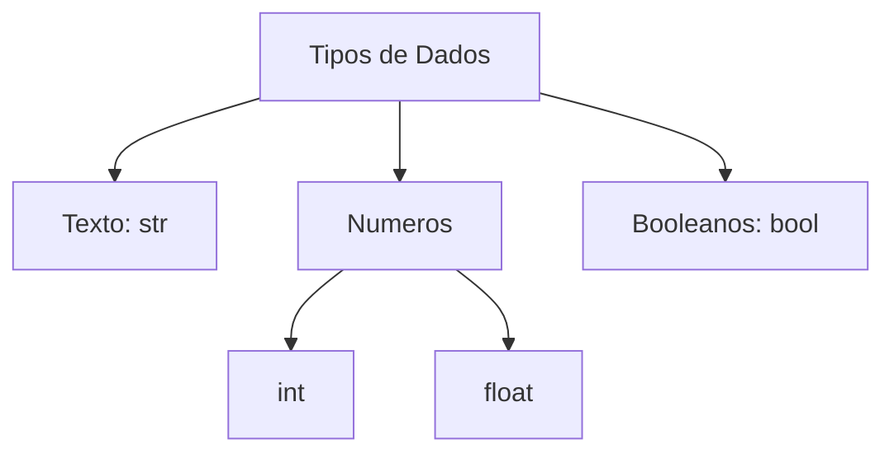

# Aula 02 - Variáveis, Tipos de Dados e Operadores

## 🎯 Objetivos da Aula

- [ ] Entender profundamente o conceito de variáveis e memória
- [ ] Conhecer os tipos primitivos: `int`, `float`, `str`, `bool`
- [ ] Aprender regras de nomeação (snake_case)
- [ ] Realizar entrada de dados com `input()`
- [ ] Converter tipos de dados (Casting)
- [ ] Conhecer os operadores aritméticos básicos

---

## 📚 Conteúdo

### 1. O que são Variáveis?

Variáveis são nomes que damos a espaços na memória do computador para guardar dados. Pense nelas como **etiquetas** em caixas.

```python
idade = 25
nome = "Ana"
preco = 19.99
```

- `idade`: O nome da variável (etiqueta).
- `=`: O operador de atribuição (significa "recebe").
- `25`: O valor armazenado na caixa.

> **Importante:** Em Python, não precisamos declarar o tipo da variável antes (tipagem dinâmica). O Python descobre sozinho.

### 2. Tipos de Dados Primitivos

Python tem 4 tipos básicos fundamentais:

| Tipo | Nome no Python | Descrição | Exemplo |
| :--- | :--- | :--- | :--- |
| **Inteiro** | `int` | Números sem vírgula (positivos, negativos ou zero) | `10`, `-5`, `0` |
| **Ponto Flutuante** | `float` | Números com vírgula (ponto decimal) | `3.14`, `2.5`, `-0.01` |
| **Texto (String)** | `str` | Sequência de caracteres entre aspas | `"Olá"`, `'Python'` |
| **Booleano** | `bool` | Valores lógicos (Verdadeiro ou Falso) | `True`, `False` |




### 3. A Função `type()`

```python
print(type(10))      # <class 'int'>
print(type(3.14))    # <class 'float'>
print(type("Olá"))   # <class 'str'>
print(type(True))    # <class 'bool'>
```

### 3. Regras de Nomeação (Boas Práticas)

Para escrever código profissional, seguimos o guia de estilo **PEP 8**.

- Use **snake_case**: letras minúsculas separadas por underline.
    - ✅ `nome_completo`, `idade_usuario`, `total_vendas`
    - ❌ `nomeCompleto`, `IdadeUsuario`, `Total-Vendas`
- Não comece com números (`1nome` ❌).
- Não use espaços (`nome usuario` ❌).
- Evite caracteres especiais (`coração` ❌).

### 4. Entrada de Dados (Input)

Para interagir com o usuário, usamos a função `input()`. Ela pausa o programa e espera o usuário digitar algo.

> ⚠️ **Atenção:** O `input()` **SEMPRE** retorna um texto (`str`), mesmo que o usuário digite um número!

```python
nome = input("Digite seu nome: ")
print(f"Olá, {nome}!")
```

### 5. Conversão de Tipos (Casting)

Como o `input()` retorna texto, se quisermos fazer contas, precisamos converter (fazer o casting) para número.

- `int()`: Converte para inteiro.
- `float()`: Converte para real.
- `str()`: Converte para texto.

```python
# Exemplo de erro comum
numero = input("Digite um número: ") # Usuário digita 5
# print(numero + 1) # ERRO! Não pode somar texto com número "5" + 1

# Forma correta
numero = int(input("Digite um número: "))
print(numero + 1) # Funciona! 6
```

### 6. Operadores Aritméticos Básicos

| Operador | Nome | Exemplo | Resultado |
| :---: | :--- | :--- | :--- |
| `+` | Adição | `5 + 2` | `7` |
| `-` | Subtração | `5 - 2` | `3` |
| `*` | Multiplicação | `5 * 2` | `10` |
| `/` | Divisão | `5 / 2` | `2.5` |
| `//` | Divisão Inteira | `5 // 2` | `2` (parte inteira) |
| `%` | Resto (Módulo) | `5 % 2` | `1` (sobra da divisão) |
| `**` | Potência | `5 ** 2` | `25` ($5^2$) |

---

## 💻 Em Prática

Vamos criar um programa que pergunta o ano de nascimento e calcula a idade aproximada.

```python
# calculadora_idade.py

# 1. Entrada
ano_nascimento = input("Em que ano você nasceu? ")

# 2. Processamento (Conversão + Cálculo)
ano_nascimento_int = int(ano_nascimento)
ano_atual = 2024 # Atualize para o ano atual
idade = ano_atual - ano_nascimento_int

# 3. Saída
print(f"Você tem (ou fará) {idade} anos.")
```

---

## 📝 Resumo

- **Variáveis** guardam dados (`nome = "João"`).
- Tipos principais: `int`, `float`, `str`, `bool`.
- `input()` lê dados do teclado (sempre como texto!).
- **Casting** (`int()`, `float()`) converte tipos de dados.
- Operadores matemáticos permitem cálculos (`+`, `-`, `*`, `/`).

---

## 🎯 Próximos Passos

<div class="grid cards" markdown>

-   :material-presentation: **Acessar Slides**
    -   [Ver Slides da Aula](../slides/slide-02.html)

-   :material-school: **Quiz**
    -   [Responder Quiz](../quizzes/quiz-02.md)

-   :material-dumbbell: **Exercícios**
    -   [Lista de Exercícios](../exercicios/exercicio-02.md)

-   :material-rocket: **Projeto**
    -   [Mini Projeto](../projetos/projeto-02.md)

</div>
