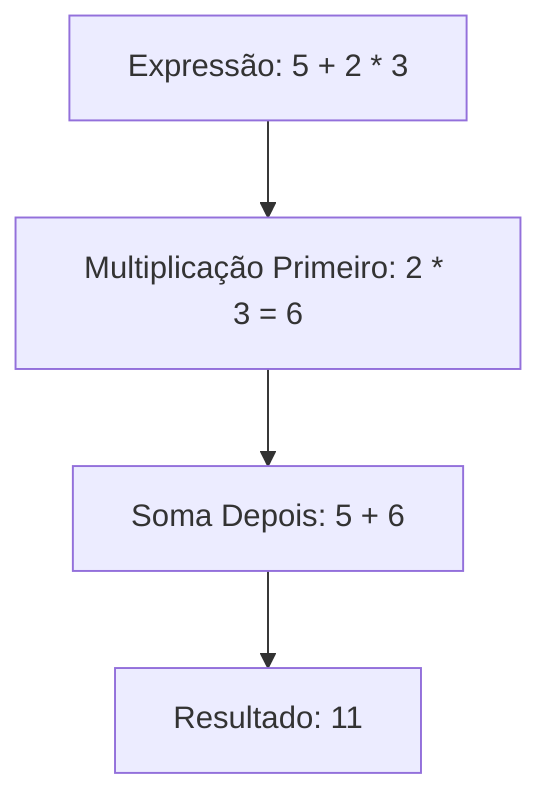

# Aula 03 - Operadores

## 🎯 Objetivos da Aula

- [ ] Revisar Operadores Aritméticos
- [ ] Aprender Operadores de Comparação (Relacionais)
- [ ] Dominar Operadores Lógicos (`and`, `or`, `not`)
- [ ] Conhecer Operadores de Atribuição (`+=`, `-=`, etc.)
- [ ] Entender a Precedência de Operadores

---

## 📚 Conteúdo

### 1. Operadores Aritméticos (Revisão)

Já vimos os básicos (`+`, `-`, `*`, `/`), mas vale relembrar e aprofundar:

```python
x = 10
y = 3

print(x + y)  # Soma: 13
print(x - y)  # Subtração: 7
print(x * y)  # Multiplicação: 30
print(x / y)  # Divisão: 3.333...
print(x // y) # Divisão Inteira: 3 (IMPORTANTE!)
print(x % y)  # Módulo (Resto): 1  (IMPORTANTE!)
print(x ** y) # Potência: 1000
```

> 💡 **Dica:** O operador de módulo (`%`) é muito usado para saber se um número é par ou ímpar.
> `numero % 2 == 0` (Par)
> `numero % 2 == 1` (Ímpar)

### 2. Operadores de Comparação (Relacionais)

Usados para comparar dois valores. O resultado é **SEMPRE** um Booleano (`True` ou `False`).

| Operador | Significado | Exemplo (`x=5`, `y=10`) | Resultado |
| :---: | :--- | :--- | :--- |
| `==` | Igual a | `x == y` | `False` |
| `!=` | Diferente de | `x != y` | `True` |
| `>` | Maior que | `x > y` | `False` |
| `<` | Menor que | `x < y` | `True` |
| `>=` | Maior ou igual a | `x >= 5` | `True` |
| `<=` | Menor ou igual a | `y <= 2` | `False` |

> ⚠️ **Cuidado:** `==` (comparação) é diferente de `=` (atribuição)!

### 3. Operadores Lógicos

Permitem combinar múltiplas condições.

| Operador | Descrição | Regra | Exemplo |
| :---: | :--- | :--- | :--- |
| `and` | E | Retorna `True` se **AMBAS** as condições forem verdadeiras. | `True and False` -> `False` |
| `or` | OU | Retorna `True` se **PELO MENOS UMA** for verdadeira. | `True or False` -> `True` |
| `not` | NÃO | Inverte o valor (De `True` para `False` e vice-versa). | `not True` -> `False` |

**Tabela Verdade:**

```python
# AND
print(True and True)   # True
print(True and False)  # False

# OR
print(True or False)   # True
print(False or False)  # False

# NOT
print(not True)        # False
```

### 4. Operadores de Atribuição

Atalhos para atualizar o valor de uma variável.

```python
saldo = 100

saldo = saldo + 50 # Atribuição normal
# Equivalente com operador de atribuição:
saldo += 50 

print(saldo) # 200 (100 + 50 + 50)

# Outros exemplos
saldo -= 20  # saldo = saldo - 20
saldo *= 2   # saldo = saldo * 2
saldo /= 10  # saldo = saldo / 10
```

### 5. Precedência de Operadores

Assim como na matemática, o Python resolve as operações em uma ordem específica:

1.  Parênteses `()`
2.  Potência `**`
3.  Multiplicação `*`, Divisão `/`, `//`, `%`
4.  Soma `+`, Subtração `-`
5.  Relacionais `==`, `!=`, `>`, etc.
6.  Lógicos `not`
7.  Lógicos `and`
8.  Lógicos `or`



---

## 💻 Em Prática

Vamos criar um programa que verifica se uma pessoa pode votar (maior de 16 anos) **E** se o voto é obrigatório (entre 18 e 70 anos).

```python
# verifica_voto.py

idade = int(input("Qual sua idade? "))

# Voto facultativo ou obrigatório?
pode_votar = idade >= 16
voto_obrigatorio = idade >= 18 and idade < 70

print(f"Pode votar? {pode_votar}")
print(f"Voto obrigatório? {voto_obrigatorio}")
```

---

## 📝 Resumo

- **Aritméticos:** Cálculos matemáticos. Destaque para `//` (inteiro) e `%` (resto).
- **Relacionais:** Comparam valores e retornam `True`/`False` (`==`, `!=`, `>`).
- **Lógicos:** Combinam booleanos (`and`, `or`, `not`).
- **Atribuição:** Atalhos para alterar variáveis (`+=`).
- **Precedência:** A ordem importa! Use parênteses `()` para forçar a ordem desejada.

---

## 🎯 Próximos Passos

<div class="grid cards" markdown>

-   :material-presentation: **Acessar Slides**
    -   [Ver Slides da Aula](../slides/slide-03.html)

-   :material-school: **Quiz**
    -   [Responder Quiz](../quizzes/quiz-03.md)

-   :material-dumbbell: **Exercícios**
    -   [Lista de Exercícios](../exercicios/exercicio-03.md)

-   :material-rocket: **Projeto**
    -   [Mini Projeto](../projetos/projeto-03.md)

</div>
