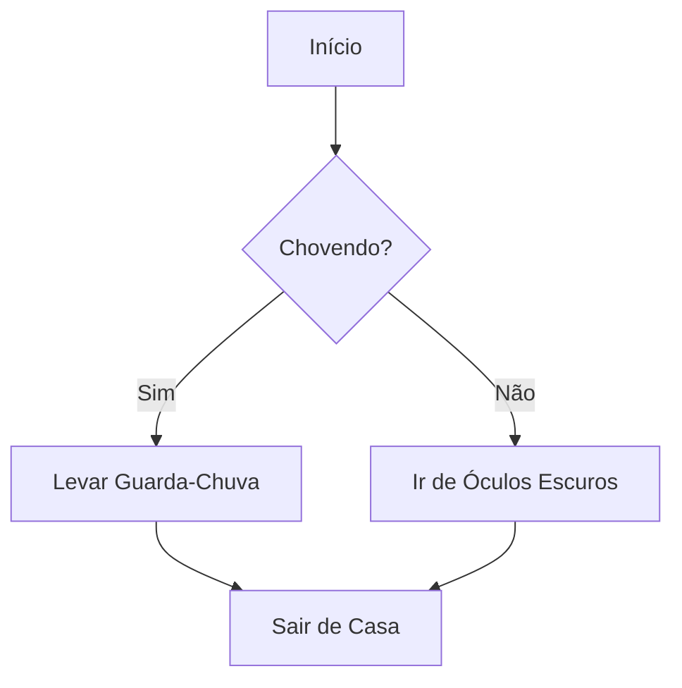

# Aula 04 - Estruturas Condicionais (if/elif/else)

## 🎯 Objetivos da Aula

- [ ] Entender o fluxo de controle de um programa
- [ ] Aprender a sintaxe do `if` (se)
- [ ] Usar o `else` (senão) para alternativas
- [ ] Usar o `elif` (senão se) para múltiplas condições
- [ ] Compreender a importância da **Indentação** em Python
- [ ] Aninhar condições (if dentro de if)

---

## 📚 Conteúdo

### 1. O que são Condicionais?

Até agora, nossos programas seguiam uma linha reta: passo 1, passo 2, passo 3...
Mas a vida real é cheia de decisões:
*"SE estiver chovendo, levo guarda-chuva. SENÃO, vou de óculos escuros."*

Em Python, usamos estruturas condicionais para desviar o fluxo do programa baseando-se em testes lógicos (`True` ou `False`).




### 2. A Estrutura `if` (Se)

O bloco `if` só executa se a condição for verdadeira (`True`).

```python
idade = 20

if idade >= 18:
    print("Você é maior de idade.")
    print("Pode entrar na festa.") # Este código também depende do if

print("Fim do programa.") # Executa sempre
```

> **🔑 Indentação:** Note que o código dentro do `if` está "empurrado" para a direita (geralmente 4 espaços). Isso diz ao Python que aquele bloco pertence ao `if`. Se tirar a indentação, dá erro ou muda a lógica!

### 3. A Estrutura `else` (Senão)

O `else` é o plano B. Ele executa **somente se** o `if` for falso.

```python
idade = 15

if idade >= 18:
    print("Maior de idade.")
else:
    print("Menor de idade.")
```

> O `else` nunca tem condição. Ele é "todo o resto".

### 4. A Estrutura `elif` (Senão Se)

Para testar várias condições em sequência. O primeiro que for verdadeiro ganha.

```python
nota = 8.5

if nota >= 9.0:
    print("Conceito A (Excelente!)")
elif nota >= 7.0:
    print("Conceito B (Aprovado)")
elif nota >= 5.0:
    print("Conceito C (Recuperação)")
else:
    print("Conceito D (Reprovado)")
```

### 5. If Aninhado (If dentro de If)

Você pode colocar um `if` dentro de outro. Isso é útil para verificar condições dependentes.

```python
idade = 20
cnh = False

if idade >= 18:
    print("Tem idade para dirigir.")
    if cnh:
        print("Pode pegar o carro!")
    else:
        print("Mas precisa tirar a CNH primeiro.")
else:
    print("Muito novo para dirigir.")
```

### 6. Combinando com Operadores Lógicos

Podemos deixar o código mais limpo usando `and`, `or`, `not`.

```python
# Versão melhor do exemplo anterior
if idade >= 18 and cnh:
    print("Pode dirigir!")
elif idade >= 18 and not cnh:
    print("Falta a CNH.")
else:
    print("Não pode dirigir.")
```

---

## 💻 Em Prática

Vamos criar um programa que verifica se um ano é Bissexto.
Regra:
1. Divisível por 4? (Sim -> pode ser. Não -> não é)
2. Divisível por 100? (Sim -> não é, a menos que...)
3. Divisível por 400? (Sim -> é!)

Simplificando: É bissexto se for divisível por 4 E (NÃO divisível por 100 OU divisível por 400).

```python
# ano_bissexto.py

ano = int(input("Digite um ano: "))

if (ano % 4 == 0 and ano % 100 != 0) or (ano % 400 == 0):
    print(f"{ano} é Bissexto!")
else:
    print(f"{ano} NÃO é Bissexto.")
```

---

## 📝 Resumo

- **`if`**: Testa uma condição.
- **`elif`**: Testa outra condição se a anterior falhou.
- **`else`**: Executa se nada acima for verdade.
- **Indentação**: Fundamental em Python para definir blocos de código.

---

## 🎯 Próximos Passos

<div class="grid cards" markdown>

-   :material-presentation: **Acessar Slides**
    -   [Ver Slides da Aula](../slides/slide-04.html)

-   :material-school: **Quiz**
    -   [Responder Quiz](../quizzes/quiz-04.md)

-   :material-dumbbell: **Exercícios**
    -   [Lista de Exercícios](../exercicios/exercicio-04.md)

-   :material-rocket: **Projeto**
    -   [Mini Projeto](../projetos/projeto-04.md)

</div>
