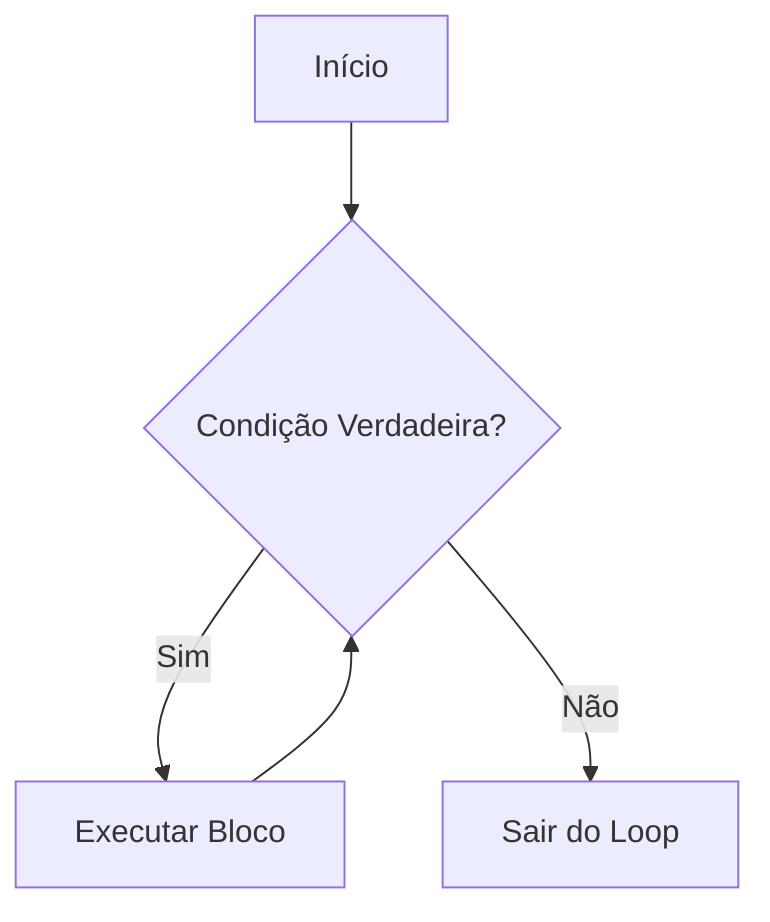

# Aula 05 - Estruturas de Repetição (for/while)

## 🎯 Objetivos da Aula

- [ ] Entender o conceito de Loops (Laços de Repetição)
- [ ] Dominar o loop `for` e a função `range()`
- [ ] Dominar o loop `while`
- [ ] Saber quando usar cada um (`for` vs `while`)
- [ ] Controlar loops com `break` e `continue`

---

## 📚 Conteúdo

### 1. O que são Loops?

Imagine que você precisa imprimir o nome de 100 alunos. Escrever 100 `print()` seria cansativo e nada inteligente.
Loops permitem repetir um bloco de código várias vezes.



### 2. O Loop `for` (Para)

O `for` é usado quando sabemos **quantas vezes** queremos repetir algo, ou para percorrer itens de uma coleção (que veremos na próxima aula).

Para repetir um número exato de vezes, usamos a função auxiliar `range()`.

`range(inicio, fim, passo)`:
- `range(5)`: Gera 0, 1, 2, 3, 4 (O limite final nunca entra!)
- `range(1, 6)`: Gera 1, 2, 3, 4, 5
- `range(0, 10, 2)`: Gera 0, 2, 4, 6, 8 (pula de 2 em 2)

```python
# Contando de 0 a 4
for i in range(5):
    print(f"Contador: {i}")

print("Fim do loop")
```

> A variável `i` (índice) atualiza automaticamente a cada volta.

### 3. O Loop `while` (Enquanto)

O `while` repete o bloco **enquanto** uma condição for verdadeira.
É usado quando **não sabemos** quantas vezes vamos repetir (ex: esperar o usuário digitar a senha certa).

```python
senha = ""

while senha != "1234":
    senha = input("Digite a senha: ")

print("Acesso liberado!")
```

> ⚠️ **Perigo: Loop Infinito!** Se a condição nunca ficar falsa, o programa roda para sempre.
> ```python
> # NUNCA FAÇA ISSO SEM UM BREAK
> while True:
>     print("Socorro!")
> ```

### 4. Controle de Loops (`break` e `continue`)

Às vezes precisamos interromper o fluxo natural do loop.

- **`break`**: Para o loop imediatamente (sai dele).
- **`continue`**: Pula a volta atual e vai para a próxima (volta pro início).

```python
# Exemplo de break
for i in range(10):
    if i == 5:
        print("Encontrei o 5, parando!")
        break
    print(i)
# Imprime 0, 1, 2, 3, 4... e para.

# Exemplo de continue
for i in range(5):
    if i == 2:
        continue # Pula o 2
    print(i)
# Imprime 0, 1, 3, 4
```

### 5. `for` vs `while`

| Loop | Melhor uso |
| :--- | :--- |
| **for** | Quando você sabe o número de repetições (ex: "repetir 10 vezes", "para cada item da lista"). |
| **while** | Quando a repetição depende de uma condição externa (ex: "enquanto o jogo não acabar", "enquanto o usuário quiser"). |

---

## 💻 Em Prática

Vamos criar uma Tabuada personalizada.

```python
# tabuada.py

numero = int(input("Tabuada de qual número? "))

print(f"--- Tabuada do {numero} ---")

for i in range(1, 11):
    resultado = numero * i
    print(f"{numero} x {i} = {resultado}")
```

---

## 📝 Resumo

- **`for`**: Ideal para sequências definidas (`range()`).
- **`while`**: Ideal para condições lógicas (`enquanto...`).
- **`range(n)`**: Gera números de 0 a n-1.
- **`break`**: Sai do loop.
- **`continue`**: Pula para a próxima iteração.
- **Cuidado** com loops infinitos no `while`!

---

## 🎯 Próximos Passos

<div class="grid cards" markdown>

-   :material-presentation: **Acessar Slides**
    -   [Ver Slides da Aula](../slides/slide-05.html)

-   :material-school: **Quiz**
    -   [Responder Quiz](../quizzes/quiz-05.md)

-   :material-dumbbell: **Exercícios**
    -   [Lista de Exercícios](../exercicios/exercicio-05.md)

-   :material-rocket: **Projeto**
    -   [Mini Projeto](../projetos/projeto-05.md)

</div>
