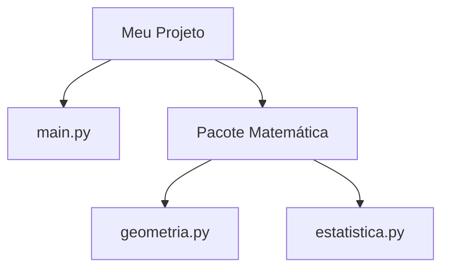

# Aula 10 - Módulos e Pacotes

## 🎯 Objetivos da Aula

- [ ] Entender o que são **Módulos** (arquivos `.py`)
- [ ] Importar módulos da biblioteca padrão (`math`, `random`, `datetime`)
- [ ] Criar seus próprios módulos
- [ ] Entender a diferença entre `import x` e `from x import y`
- [ ] Conhecer o conceito de **Pacotes** (pastas)

---

## 📚 Conteúdo

### 1. O que são Módulos?

Um módulo é simplesmente um arquivo com extensão `.py` contendo código Python (funções, variáveis, classes).
O objetivo é **organizar** o projeto, separando responsabilidades. Em vez de um arquivo gigante com 1000 linhas, temos 10 arquivos de 100 linhas com nomes claros.

### 2. Importando Módulos

Usamos a palavra-chave `import` para trazer funcionalidades de outros arquivos.

**Exemplo: Biblioteca Padrão (Built-in)**
O Python já vem com "baterias inclusas", vários módulos prontos.

```python
import math

raiz = math.sqrt(25)
print(raiz) # 5.0
```

### 3. Variações de Importação

Podemos importar apenas o que precisamos, economizando memória e digitação.

```python
# Importa APENAS a função sqrt
from math import sqrt

raiz = sqrt(81) # Não precisa usar math.sqrt()
print(raiz) # 9.0
```

**Apelidos (Alias):**
Podemos dar um nome curto para o módulo.

```python
import datetime as dt

agora = dt.datetime.now()
print(agora)
```

### 4. Criando seu Próprio Módulo

Imagine que temos um arquivo `utilidades.py`:

```python
# Arquivo: utilidades.py
def dobro(x):
    return x * 2

taxa_padrao = 0.1
```

Podemos usar esse código em outro arquivo (`main.py`):

```python
# Arquivo: main.py
import utilidades

resultado = utilidades.dobro(10)
print(resultado) # 20

print(utilidades.taxa_padrao) # 0.1
```

### 5. O que são Pacotes?

Pacotes são **pastas** que contêm módulos.
Para o Python entender uma pasta como pacote, antigamente era obrigatório ter um arquivo `__init__.py` (hoje é opcional, mas boa prática).

Estrutura:



```text
meu_projeto/
├── main.py
└── matematica/          <-- Pacote
    ├── __init__.py
    ├── geometria.py     <-- Módulo
    └── estatistica.py   <-- Módulo
```

Uso:
```python
from matematica import geometria

area = geometria.calcular_area_quadrado(4)
```

---

## 💻 Em Prática

Vamos criar um "Gerador de Senhas" usando o módulo `random` e `string`.

```python
# gerador_senha.py
import random
import string

def gerar_senha(tamanho=8):
    # Letras + Números + Pontuação
    caracteres = string.ascii_letters + string.digits + string.punctuation
    
    senha = ""
    for _ in range(tamanho):
        senha += random.choice(caracteres)
    
    return senha

# Testando
print(gerar_senha(12))
```

---

## 📝 Resumo

- **Módulo**: Arquivo `.py`.
- **Pacote**: Pasta com módulos.
- **`import math`**: Importa tudo (acessa com `math.func`).
- **`from math import sqrt`**: Importa específico (acessa direto `sqrt`).
- **`import pandas as pd`**: Importa com apelido.

---

## 🎯 Próximos Passos

<div class="grid cards" markdown>

-   :material-presentation: **Acessar Slides**
    -   [Ver Slides da Aula](../slides/slide-10.html)

-   :material-school: **Quiz**
    -   [Responder Quiz](../quizzes/quiz-10.md)

-   :material-dumbbell: **Exercícios**
    -   [Lista de Exercícios](../exercicios/exercicio-10.md)

-   :material-rocket: **Projeto**
    -   [Mini Projeto](../projetos/projeto-10.md)

</div>
