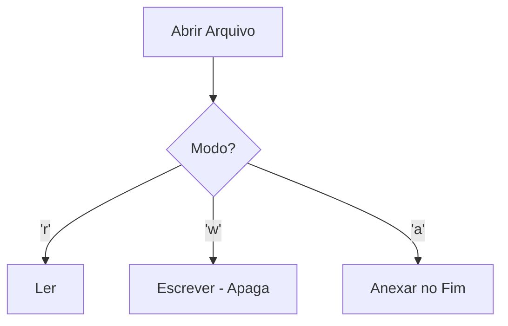

# Aula 11 - Manipulação de Arquivos

## 🎯 Objetivos da Aula

- [ ] Abrir, ler e fechar arquivos de texto (`open`, `close`)
- [ ] Usar o bloco `with` (Gerenciador de Contexto)
- [ ] Escrever em arquivos (modos `w`, `a`)
- [ ] Ler arquivos (modos `r`)
- [ ] Criar um log simples

---

## 📚 Conteúdo

### 1. Abrindo Arquivos

Para mexer com arquivos, usamos a função `open()`. Ela precisa de dois argumentos principais:
1. O caminho do arquivo.
2. O modo de abertura (`mode`).

Modos comuns:
- `'r'` (**Read**): Leitura. (Padrão). Erro se não existir.
- `'w'` (**Write**): Escrita. **Apaga** tudo se já existir. Cria se não existir.
- `'x'` (**Exclusive**): Cria arquivo. Erro se já existir.



```python
# Modo "antigo" (não recomendado)
arquivo = open("nota.txt", "w")
arquivo.write("Olá, arquivo!")
arquivo.close() # Obrigatório fechar!
```

### 2. O Bloco `with` (Recomendado)

Esquecer de fechar o arquivo (`close`) é um erro comum que causa vazamento de memória.
O `with` fecha o arquivo automaticamente, mesmo se der erro no meio do caminho.

```python
with open("nota.txt", "w") as arquivo:
    arquivo.write("Isso é muito mais seguro.")
    # Ao sair daqui, o arquivo fecha sozinho.
```

### 3. Escrevendo em Arquivos

O método `.write()` escreve strings. Se quiser pular linha, use `\n`.

```python
# Escrevendo (subscreve tudo)
with open("diario.txt", "w", encoding="utf-8") as f:
    f.write("Querido diário,\n")
    f.write("Hoje aprendi Python.\n")

# Adicionando (append)
with open("diario.txt", "a", encoding="utf-8") as f:
    f.write("Foi muito legal.\n")
```

> **Dica:** Sempre use `encoding="utf-8"` para garantir que acentos funcionem corretamente.

### 4. Lendo Arquivos

Existem várias formas de ler:

- `.read()`: Lê o arquivo **inteiro** como uma string única.
- `.readline()`: Lê **uma linha** de cada vez.
- `.readlines()`: Retorna uma **lista** onde cada linha é um item.

```python
with open("diario.txt", "r", encoding="utf-8") as f:
    conteudo = f.read()
    print(conteudo)

# Lendo linha por linha (ideal para arquivos grandes)
with open("diario.txt", "r", encoding="utf-8") as f:
    for linha in f:
        print(linha.strip()) # strip remove o \n extra
```

---

## 💻 Em Prática

Vamos criar um sistema de Log que registra quando o usuário entrou no sistema.

```python
# sistema_log.py
from datetime import datetime

def registrar_log(mensagem):
    data_hora = datetime.now().strftime("%d/%m/%Y %H:%M:%S")
    log = f"[{data_hora}] {mensagem}\n"
    
    with open("sistema.log", "a", encoding="utf-8") as arquivo:
        arquivo.write(log)

registrar_log("Sistema iniciado.")
registrar_log("Usuário 'admin' fez login.")
registrar_log("Erro de conexão com banco de dados.")

print("Log registrado com sucesso!")
```

---

## 📝 Resumo

- **`open(arquivo, modo)`**: Abre o arquivo.
- **`with open(...) as f:`**: Garante o fechamento seguro.
- **Modos**: `'r'` (ler), `'w'` (escrever/apagar), `'a'` (adicionar).
- **Encoding**: Use `utf-8` para acentos.
- **`f.write()`**: Escreve string.
- **`f.read()`**: Lê tudo.

---

## 🎯 Próximos Passos

<div class="grid cards" markdown>

-   :material-presentation: **Acessar Slides**
    -   [Ver Slides da Aula](../slides/slide-11.html)

-   :material-school: **Quiz**
    -   [Responder Quiz](../quizzes/quiz-11.md)

-   :material-dumbbell: **Exercícios**
    -   [Lista de Exercícios](../exercicios/exercicio-11.md)

-   :material-rocket: **Projeto**
    -   [Mini Projeto](../projetos/projeto-11.md)

</div>
