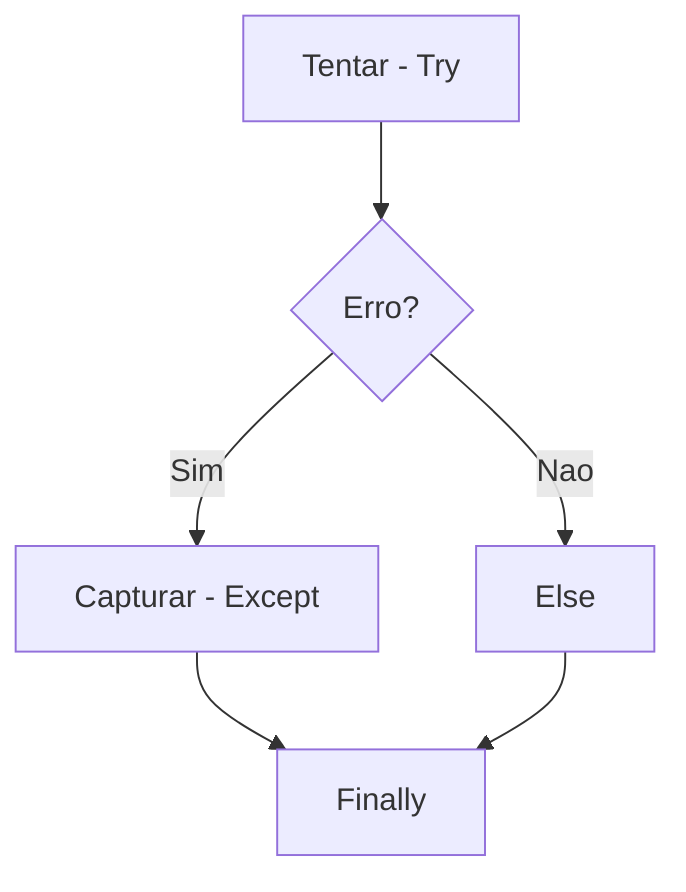

# Aula 12 - Tratamento de Erros e Exceções

## 🎯 Objetivos da Aula

- [ ] Entender o que são Exceções
- [ ] Usar blocos `try` e `except` para evitar que o programa quebre
- [ ] Conhecer o `else` (quando tudo dá certo) e `finally` (sempre executa)
- [ ] Capturar erros específicos (`ValueError`, `ZeroDivisionError`)
- [ ] Lançar exceções propositalmente (`raise`)

---

## 📚 Conteúdo

### 1. O Problema

Até agora, se o usuário digitasse texto quando pedíamos um número, o programa **capotava** (Crash 💥).

```python
idade = int(input("Idade: ")) # Se digitar "dez", explode!
print(f"Sua idade é {idade}")
```

Erro: `ValueError: invalid literal for int() with base 10: 'dez'`

### 2. A Solução: `try` / `except`

Podemos "tentar" executar um código perigoso e, se der erro, "capturar" a exceção.

```python
try:
    idade = int(input("Idade: "))
    print(f"Sua idade é {idade}")
except:
    print("Por favor, digite apenas números!")

print("O programa continua...")
```

### 3. Capturando Erros Específicos

É má prática usar um `except` genérico (catch-all), pois pode esconder erros que você não previa. Capture apenas o que espera!

```python
try:
    a = int(input("Numerador: "))
    b = int(input("Denominador: "))
    resultado = a / b
    print(f"Resultado: {resultado}")

except ValueError:
    print("Erro: Você digitou letras em vez de números.")
except ZeroDivisionError:
    print("Erro: Não é possível dividir por zero.")
except Exception as e:
    print(f"Erro inesperado: {e}") # Captura qualquer outro erro
```

### 4. `else` e `finally`

O bloco completo tem 4 partes:

1.  `try`: Tenta executar.
2.  `except`: Roda se der erro.
3.  `else`: Roda se **NÃO** der erro.
4.  `finally`: Roda **SEMPRE** (com ou sem erro).



```python
try:
    arquivo = open("dados.txt", "r")
    conteudo = arquivo.read()
except FileNotFoundError:
    print("Arquivo não encontrado.")
else:
    print("Leitura realizada com sucesso!")
finally:
    print("Fechando conexão...")
    # Útil para fechar arquivos, conexões de banco, etc.
    if 'arquivo' in locals() and not arquivo.closed:
        arquivo.close()
```

### 5. Lançando Erros (`raise`)

Você pode criar seus próprios erros quando uma regra de negócio é violada.

```python
def cadastrar_usuario(nome, idade):
    if idade < 0:
        raise ValueError("A idade não pode ser negativa!")
    
    print(f"Usuário {nome} cadastrado.")

try:
    cadastrar_usuario("Ana", -5)
except ValueError as erro:
    print(erro) # Imprime "A idade não pode ser negativa!"
```

---

## 💻 Em Prática

Vamos blindar nossa calculadora de divisão.

```python
# divisao_segura.py

def dividir(a, b):
    try:
        return a / b
    except ZeroDivisionError:
        return None # Ou lançar um erro personalizado

while True:
    try:
        n1 = float(input("Digite o n1: "))
        n2 = float(input("Digite o n2: "))
        
        res = dividir(n1, n2)
        
        if res is None:
            print("Não pode dividir por zero!")
        else:
            print(f"Divisão: {res}")
            break # Sai do loop se der certo
            
    except ValueError:
        print("Digite apenas números válidos!")
```

---

## 📝 Resumo

- **Exceções** são erros que ocorrem durante a execução.
- **`try`**: Bloco de código arriscado.
- **`except`**: Tratamento do erro.
- **`else`**: Executa se o try funcionar.
- **`finally`**: Executa sempre (limpeza).
- **`raise`**: Força um erro.

---

## 🎯 Próximos Passos

<div class="grid cards" markdown>

-   :material-presentation: **Acessar Slides**
    -   [Ver Slides da Aula](../slides/slide-12.html)

-   :material-school: **Quiz**
    -   [Responder Quiz](../quizzes/quiz-12.md)

-   :material-dumbbell: **Exercícios**
    -   [Lista de Exercícios](../exercicios/exercicio-12.md)

-   :material-rocket: **Projeto**
    -   [Mini Projeto](../projetos/projeto-12.md)

</div>
