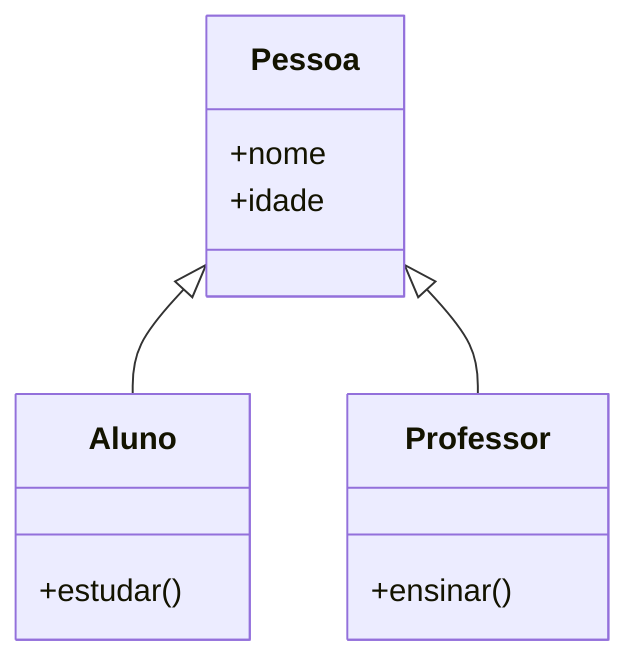

# Aula 14 - Orientação a Objetos (Avançado)

## 🎯 Objetivos da Aula

- [ ] Entender o conceito de **Herança** (Inheritance)
- [ ] Aplicar **Polimorfismo** (Polymorphism)
- [ ] Conhecer o **Encapsulamento** (variáveis "privadas")
- [ ] Sobrescrever métodos (`super()`)

---

## 📚 Conteúdo

### 1. Herança (Inheritance)

A Herança permite criar uma nova classe baseada em uma já existente.
Ela "herda" todos os atributos e métodos da classe pai (Superclasse).

**Exemplo:**
Um `Aluno` **é uma** `Pessoa`.
Um `Professor` **é uma** `Pessoa`.
Ambos têm nome e idade, mas fazem coisas diferentes.



```python
class Pessoa: # Classe Pai (Superclasse)
    def __init__(self, nome, idade):
        self.nome = nome
        self.idade = idade

    def se_apresentar(self):
        print(f"Olá, sou {self.nome}.")

class Aluno(Pessoa): # Classe Filha (Subclasse)
    def estudar(self):
        print(f"{self.nome} está estudando.")

# Testando
p1 = Pessoa("Carlos", 40)
a1 = Aluno("Ana", 20)

a1.se_apresentar() # Herdou de Pessoa!
a1.estudar()       # Método exclusivo de Aluno
# p1.estudar()     # ERRO! Pessoa não estuda (genericamente)
```

### 2. Polimorfismo

Polimorfismo significa "muitas formas".
Classes filhos podem ter o **mesmo método** da classe pai, mas com comportamento diferente.

```python
class Animal:
    def fazer_som(self):
        print("Som genérico")

class Cachorro(Animal):
    def fazer_som(self): # Sobrescrita (Override)
        print("Au au!")

class Gato(Animal):
    def fazer_som(self):
        print("Miau!")

# A mágica do Polimorfismo
animais = [Cachorro(), Gato(), Animal()]

for bicho in animais:
    bicho.fazer_som()
    # O Python sabe qual método chamar para cada tipo!
```

### 3. O Método `super()`

Às vezes, queremos usar a lógica da classe pai e ADICIONAR algo a mais.

```python
class Aluno(Pessoa):
    def __init__(self, nome, idade, matricula):
        # Chama o construtor da Pessoa para cuidar do nome e idade
        super().__init__(nome, idade)
        self.matricula = matricula # Atributo exclusivo

    def se_apresentar(self):
        super().se_apresentar() # Chama o original
        print(f"Minha matrícula é {self.matricula}")
```

### 4. Encapsulamento (Privado vs Público)

Em Python, não existem atributos verdadeiramente "privados" (como em Java), mas temos uma convenção forte:

- `self.nome`: Público. Pode ser acessado de qualquer lugar.
- `self._saldo`: Protegido. Só deve ser acessado dentro da classe ou subclasses. (Aviso aos programadores: "Cuidado").
- `self.__senha`: Privado. O Python muda o nome internamente para dificultar o acesso direto.

```python
class Conta:
    def __init__(self, saldo):
        self.__saldo = saldo # Privado

    def get_saldo(self): # Getter
        return self.__saldo

c = Conta(100)
# print(c.__saldo) # ERRO! Não existe (diretamente)
print(c.get_saldo()) # 100 (Acesso controlado)
```

---

## 💻 Em Prática

Vamos refatorar o sistema bancário com Herança.

```python
class Conta:
    def __init__(self, titular):
        self.titular = titular
        self.saldo = 0

    def depositar(self, valor):
        self.saldo += valor

class ContaCorrente(Conta):
    def sacar(self, valor):
        if valor <= self.saldo:
            self.saldo -= valor
            print("Saque realizado.")
        else:
            print("Saldo insuficiente.")

class ContaPoupanca(Conta):
    def render_juros(self):
        self.saldo *= 1.05 # Rende 5%
        print("Juros aplicados.")
```

---

## 📝 Resumo

- **Herança (`class Filho(Pai):`)**: Reutiliza código.
- **Polimorfismo**: Métodos com mesmo nome, comportamentos diferentes.
- **`super()`**: Acessa a classe pai.
- **Encapsulamento**: Protege dados sensíveis (`__var`).

---

## 🎯 Próximos Passos

<div class="grid cards" markdown>

-   :material-presentation: **Acessar Slides**
    -   [Ver Slides da Aula](../slides/slide-14.html)

-   :material-school: **Quiz**
    -   [Responder Quiz](../quizzes/quiz-14.md)

-   :material-dumbbell: **Exercícios**
    -   [Lista de Exercícios](../exercicios/exercicio-14.md)

-   :material-rocket: **Projeto**
    -   [Mini Projeto](../projetos/projeto-14.md)

</div>
