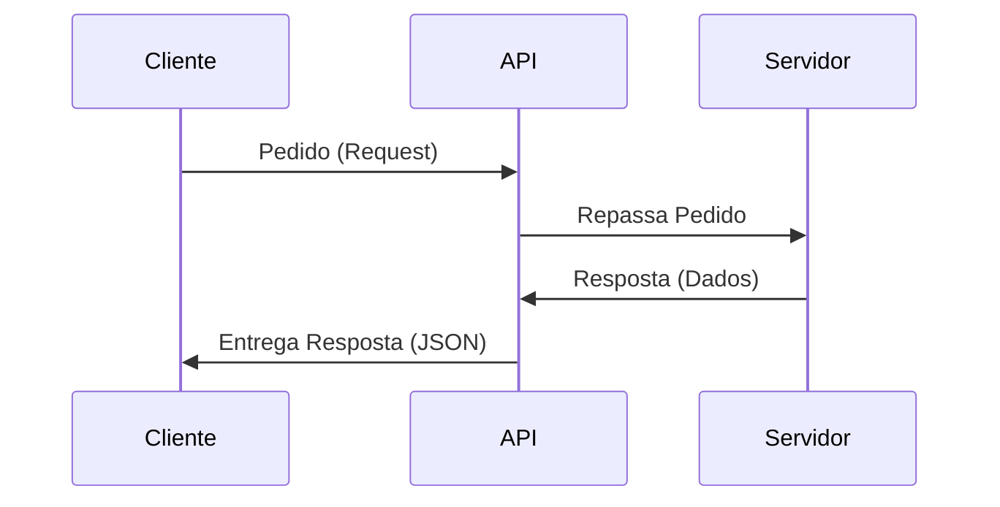

# Aula 15 - APIs, JSON e Requisições

## 🎯 Objetivos da Aula

- [ ] Entender o que é uma **API** (Application Programming Interface)
- [ ] Conhecer o formato **JSON** (JavaScript Object Notation)
- [ ] Fazer requisições HTTP (`GET`) para consumir dados da internet
- [ ] Usar a biblioteca `requests`

---

## 📚 Conteúdo

### 1. O que é uma API?

API é como um garçom.
- **Você (Cliente):** Faz o pedido ("Quero a previsão do tempo").
- **API (Garçom):** Leva o pedido até a cozinha (Servidor).
- **Servidor (Cozinha):** Prepara os dados.
- **API:** Traz a resposta para você.



Grandes sites (Google, Facebook, Twitter, Previsão do Tempo) oferecem APIs para que nossos programas possam interagir com eles.

### 2. O Formato JSON

Como os sistemas conversam? Eles usam JSON, que é MUITO parecido com os Dicionários do Python.

```json
{
  "cidade": "São Paulo",
  "temperatura": 25,
  "chuva": false,
  "previsao": ["Sol", "Nublado"]
}
```

Em Python, usamos a biblioteca `json` para traduzir:
- `json.dumps()`: Dicionário -> JSON (String).
- `json.loads()`: JSON (String) -> Dicionário.

### 3. A biblioteca `requests`

O Python não vem com `requests` instalado por padrão, mas é a biblioteca mais famosa do mundo. (Vamos assumir que está instalada ou mostrar como usar `urllib` nativa se preferir, mas `requests` é o padrão de mercado).

*Nota: Se estivéssemos em um ambiente local, rodaríamos `pip install requests`.*

```python
import requests

# Fazendo um pedido (GET) para uma API pública
resposta = requests.get("https://viacep.com.br/ws/01001000/json/")

# Verificando se deu certo (Status 200 = OK)
if resposta.status_code == 200:
    dados = resposta.json() # Converte JSON para Dicionário
    print(dados['logradouro']) # Praça da Sé
else:
    print("Erro na requisição")
```

### 4. Métodos HTTP

- **GET:** Buscar dados (Leitura).
- **POST:** Enviar dados (Criar).
- **PUT/PATCH:** Atualizar dados.
- **DELETE:** Apagar dados.

Hoje focaremos no **GET**.

---

## 💻 Em Prática

Vamos criar um Consultor de CEP usando a API gratuita ViaCEP.

```python
# consulta_cep.py
import requests

def buscar_cep(cep):
    # API do ViaCEP
    url = f"https://viacep.com.br/ws/{cep}/json/"
    
    try:
        response = requests.get(url)
        response.raise_for_status() # Lança erro se status != 200
        
        dados = response.json()
        
        if "erro" in dados:
            return None
        
        return dados
        
    except requests.exceptions.RequestException as e:
        print(f"Erro de conexão: {e}")
        return None

# Programa Principal
cep_input = input("Digite o CEP (apenas números): ")

resultado = buscar_cep(cep_input)

if resultado:
    print(f"Endereço: {resultado['logradouro']}")
    print(f"Bairro: {resultado['bairro']}")
    print(f"Cidade: {resultado['localidade']} - {resultado['uf']}")
else:
    print("CEP não encontrado ou inválido.")
```

---

## 📝 Resumo

- **API:** Ponte entre sistemas.
- **JSON:** Formato padrão de troca de dados (parece `dict`).
- **Requests:** Biblioteca para acessar a web.
- **GET:** Método para "pegar" dados.

---

## 🎯 Próximos Passos

<div class="grid cards" markdown>

-   :material-presentation: **Acessar Slides**
    -   [Ver Slides da Aula](../slides/slide-15.html)

-   :material-school: **Quiz**
    -   [Responder Quiz](../quizzes/quiz-15.md)

-   :material-dumbbell: **Exercícios**
    -   [Lista de Exercícios](../exercicios/exercicio-15.md)

-   :material-rocket: **Projeto**
    -   [Mini Projeto](../projetos/projeto-15.md)

</div>
