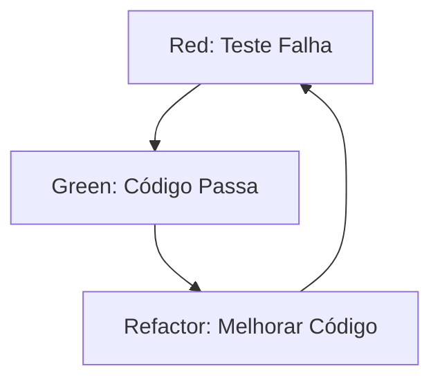

# Aula 16 - Testes e TDD (Test Driven Development)

## 🎯 Objetivos da Aula

- [ ] Compreender a importância dos **Testes Automatizados**
- [ ] Conhecer a filosofia **TDD** (Desenvolvimento Guiado por Testes)
- [ ] Usar a biblioteca `pytest` (padrão de mercado)
- [ ] Estruturar um projeto Python profissional

---

## 📚 Conteúdo

### 1. Por que testar?

Imagine que você consertou um erro no código, mas sem querer quebrou outra parte que estava funcionando. Isso se chama **Regressão**.
Testes automatizados garantem que seu código continua funcionando como esperado, mesmo após alterações.

> "Código sem testes é código legado." - Michael Feathers

### 2. O que é TDD?

TDD (**Test Driven Development**) é uma técnica onde você escreve o teste **ANTES** do código.
O ciclo do TDD (Red-Green-Refactor):

1.  🔴 **Red:** Escreva um teste que falha (porque a funcionalidade ainda não existe).
2.  🟢 **Green:** Escreva o código mínimo necessário para o teste passar.
3.  🔵 **Refactor:** Melhore o código (limpeza), mantendo o teste passando.



### 3. A biblioteca `pytest`

O Python tem o `unittest` nativo, mas o mundo usa `pytest` porque é mais simples e poderoso.
Ele procura automaticamente arquivos que começam com `test_` ou terminam com `_test.py`.

```python
# test_calculadora.py
def test_soma():
    assert 2 + 2 == 4
```

Para rodar, basta digitar no terminal:
`pytest`

### 4. Escrevendo Tests Profissionais

Um teste geralmente segue o padrão **AAA**:
- **Arrange (Preparar):** Cria os objetos e dados necessários.
- **Act (Agir):** Chama a função que queremos testar.
- **Assert (Verificar):** Confere se o resultado é o esperado.

```python
def test_deve_adicionar_item_na_lista():
    # Arrange
    lista = []
    item = "Arroz"
    
    # Act
    lista.append(item)
    
    # Assert
    assert len(lista) == 1
    assert lista[0] == "Arroz"
```

### 5. Estrutura de Projeto

Organização é tudo. Um projeto Python moderno se parece com isso:

```text
meu_projeto/
├── src/             <-- Código fonte (source)
│   ├── __init__.py
│   └── main.py
├── tests/           <-- Testes
│   ├── __init__.py
│   └── test_main.py
├── README.md        <-- Documentação
└── pyproject.toml   <-- Configurações e Dependências
```

---

## 💻 Em Prática (Mini TDD)

Vamos criar uma função que retorna o dobro, usando TDD.

**Passo 1 (Red):** Criar o teste `test_dobro.py`.
```python
from app import dobro

def test_dobro_de_cinco():
    assert dobro(5) == 10
```
*Se rodar agora, dá erro (ImportError), pois `app.py` nem existe.*

**Passo 2 (Green):** Criar `app.py` com o mínimo para passar.
```python
def dobro(x):
    return x * 2
```
*Agora roda o `pytest` e passa!*

**Passo 3 (Refactor):** Melhorar se necessário (neste caso, já está simples).

---

## 📝 Resumo

- **TDD:** Teste antes do código.
- **Ciclo:** Vermelho -> Verde -> Refatorar.
- **Pytest:** Ferramenta poderosa e simples.
- **Assert:** O comando que valida se é Verdade ou Falso.
- **Confiança:** Testes dão segurança para mudar o código.

---

## 🎯 Próximos Passos

<div class="grid cards" markdown>

-   :material-presentation: **Acessar Slides**
    -   [Ver Slides da Aula](../slides/slide-16.html)

-   :material-school: **Quiz**
    -   [Responder Quiz](../quizzes/quiz-16.md)

-   :material-dumbbell: **Exercícios**
    -   [Lista de Exercícios](../exercicios/exercicio-16.md)

-   :material-rocket: **Projeto Final**
    -   [Gerenciador de Tarefas com TDD](../projetos/projeto-16.md)

</div>
